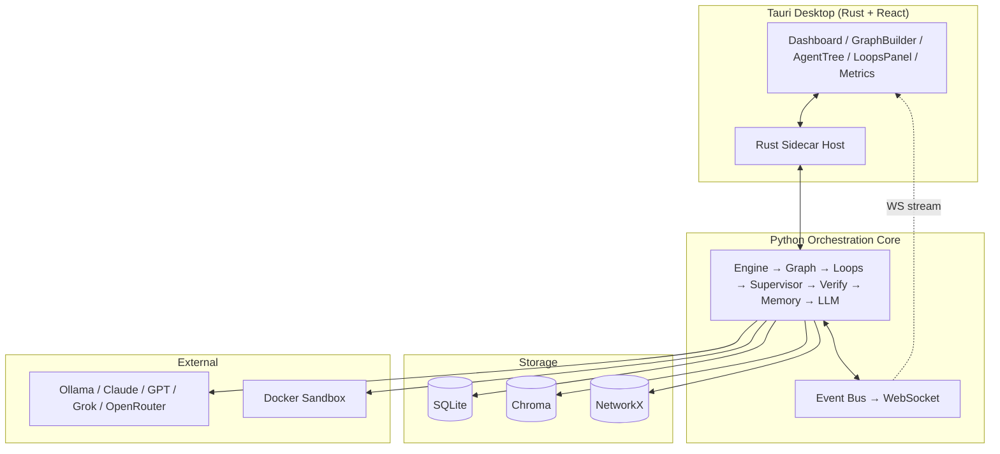

# MaestroAgent

**The ultimate conductor for AI agents — a local-first, model-agnostic desktop "Agent OS" for orchestrating fleets of autonomous agents with advanced looping, dynamic hierarchical sub-agents, persistent memory, and verifiable autonomy.**

[](LICENSE)
[](https://www.python.org/downloads/)
[](https://tauri.app)
[](#roadmap)

---

## Why MaestroAgent?

Existing orchestrators force a trade-off: **CrewAI** is fast to prototype but brittle in production; **LangGraph** is robust but verbose; **Bridgemind / RunMaestro** are closed or limited. MaestroAgent is the **first open, hybrid orchestrator** that combines the ergonomic "crew" abstraction with industrial-grade stateful graphs, native advanced loops, dynamic hierarchical sub-agents, and full observability — all in a local-first desktop app with seamless cloud burst.

### Headline differentiators

| Dimension | MaestroAgent | CrewAI | LangGraph | Bridgemind / RunMaestro |
|---|---|---|---|---|
| Local-first desktop app | ✅ Tauri + Rust + React | ❌ Lib only | ❌ Lib only | ⚠️ Partial |
| Hybrid graphs + crews | ✅ Crews inside graphs | ❌ Crews only | ❌ Graphs only | ⚠️ |
| Advanced loops (until-verifiable, cron, webhook, file, nested/parallel/meta) | ✅ Native | ❌ Manual | ⚠️ Basic | ⚠️ |
| Dynamic hierarchical sub-agents | ✅ Supervisor + debate/vote/critic | ⚠️ Static | ⚠️ Manual | ⚠️ |
| Model-agnostic routing + cost optimization | ✅ First-class | ⚠️ | ⚠️ | ❌ |
| Multi-tier memory (short/semantic/graph/long-term) | ✅ | ⚠️ | ⚠️ | ⚠️ |
| Verification (critic, evaluator-optimizer, sandbox) | ✅ | ❌ | ⚠️ | ⚠️ |
| Visual graph builder + drag-drop + export | ✅ | ❌ | ❌ | ⚠️ |
| Live control (spawn sub-agents, trigger debates, create loops mid-run) | ✅ | ❌ | ❌ | ❌ |
| Voice input | ✅ Web Speech API | ❌ | ❌ | ❌ |
| Open source (MIT) | ✅ | ✅ | ✅ (MIT) | ❌ |

See [`docs/DIFFERENTIATION.md`](docs/DIFFERENTIATION.md) for the full breakdown.

---

## Architecture at a glance



Full diagrams (component, sequence, React tree, security zones): [`docs/ARCHITECTURE_FULLSTACK.md`](docs/ARCHITECTURE_FULLSTACK.md). Layered design: [`docs/ARCHITECTURE.md`](docs/ARCHITECTURE.md).

---

## Quick start

### Prerequisites

- **Python 3.11+**, **Node.js 20+**, **pnpm 9+**, **Rust stable**
- **Tauri 2 system deps** — see [Tauri prereqs](https://v2.tauri.app/start/prerequisites/)
- *(optional)* **Ollama** or **LM Studio** for local models
- *(optional)* **Docker** for sandboxed tools

### 1. Backend (Python core)

```bash
cd backend
python -m venv .venv && source .venv/bin/activate    # Windows: .venv\Scripts\activate
pip install -e ".[dev]"
maestro --version
maestro doctor    # checks Python, deps, Ollama, Docker, API keys
```

Run the API server standalone:

```bash
maestro serve --host 127.0.0.1 --port 8765
```

### 2. Desktop app

```bash
cd desktop
pnpm install
pnpm tauri dev
```

The Tauri app auto-spawns the Python sidecar on first run. Open the desktop window → **Templates** → pick a workflow → **Launch Run**.

### 3. Run an example workflow

From the CLI:
```bash
maestro run examples/templates/build_saas_mvp.py --goal "Build a notes SaaS with auth + Stripe"
```

Or from the desktop UI: **Templates** → **build_saas_mvp** → set goal (or 🎤 voice) → **Launch**.

---

## Project layout

```
MaestroAgent/
├── backend/                # Python core (FastAPI sidecar)
│   ├── maestro_core/       # Stateful graph engine, checkpoints, streaming
│   ├── maestro_agents/     # Agent, Supervisor, SubAgent, CrewAdapter, Debate
│   ├── maestro_loops/      # Native loops: recursive, cron, webhook, nested, parallel, meta
│   ├── maestro_memory/     # Short-term, vector, graph, long-term + manager
│   ├── maestro_verify/     # Critic, evaluator-optimizer, sandbox, recovery
│   ├── maestro_llm/        # Router + 6 providers + cost ledger
│   ├── maestro_api/        # FastAPI + WebSocket + 8 route groups
│   ├── maestro_plugins/    # Discovery + builtin tools
│   ├── maestro_cli/        # `maestro` command
│   ├── examples/templates/ # build_saas_mvp, research_crew, ops_autopilot
│   ├── sandbox/            # Docker sandbox image
│   └── tests/              # pytest suite
├── desktop/                # Tauri 2 + React 18 + TypeScript
│   ├── src/                # 17 React components + store + hooks
│   └── src-tauri/          # Rust shell + 17 Tauri commands
└── docs/                   # 7 docs (architecture, setup, roadmap, etc.)
```

**~94 files, ~8,250 LOC.** Full tree: [`docs/PROJECT_STRUCTURE.md`](docs/PROJECT_STRUCTURE.md).

---

## What you can do in the desktop app

| Panel | What it does |
|---|---|
| **Dashboard** | Live run summary + event stream + quick stats |
| **Graph Builder** | Drag-and-drop workflow editor (ReactFlow) with custom nodes for agents, supervisors, loops, gates, HITL. Export/import JSON. |
| **Agents** | Live hierarchy tree. Click **+** on a supervisor to spawn a sub-agent. Select 2+ agents to trigger a debate. |
| **Loops** | Monitor active loops with progress bars, scores, and outcomes. Click **New Loop** to attach a verifiable loop mid-run (tests / metric / critic exit conditions). |
| **Terminal** | Console-style live event log |
| **Files** | Browse the workspace produced by the run |
| **Metrics** | Cost breakdown by provider, token usage, loop iteration histograms |
| **Templates** | One-click workflows + marketplace stub |

**Modals:**
- **Start Run** — goal textarea with 🎤 voice input, budget slider, provider picker
- **Spawn Sub-agent** — role, goal, backstory, tools, LLM hint, memory scope
- **Trigger Debate** — topic, participants, seek-consensus toggle
- **Create Loop** — body agent, exit condition (tests/metric/critic), budget, on-exceed policy

---

## What makes it production-ready

- **Persistent checkpoints** — every graph step is persisted; resume after crash or reboot.
- **Model fallback** — if a provider fails, automatically degrade to a configured backup (circuit breaker).
- **Cost guardrails** — per-run budget caps, real-time spend tracking, provider-aware routing.
- **Audit logs** — every agent decision, tool call, and state transition is recorded in a tamper-evident hash-chained log.
- **Sandboxed tools** — Git/Docker/browser/cloud actions run inside a read-only Docker container with no network by default.
- **Human-in-the-loop** — pause any loop, request approval, inject corrections. HITL gates for high-stakes tools.
- **Streaming everything** — events flow over WebSocket for live UIs and external hooks.
- **Voice input** — Web Speech API for speech-to-agent goal entry.

---

## Roadmap (condensed)

- **v0.1 (alpha)** — core graph engine, sub-agents, native loops, basic UI, SQLite + Chroma memory. ✅ (this release)
- **v0.2** — visual graph builder polish, evaluator-optimizer UI, plugin marketplace scaffolding.
- **v0.3** — multi-user collaboration, Git-like workflow versioning, cloud burst, voice + multimodal input.
- **v1.0** — self-improving meta-agent, full marketplace, one-click deploy, analytics dashboard. See [`docs/ROADMAP.md`](docs/ROADMAP.md).

---

## Documentation

| Doc | What's inside |
|---|---|
| [README.md](README.md) | This file — overview + quick start |
| [docs/ARCHITECTURE.md](docs/ARCHITECTURE.md) | Layered architecture, design principles, data model |
| [docs/ARCHITECTURE_FULLSTACK.md](docs/ARCHITECTURE_FULLSTACK.md) | Refreshed full-stack diagrams (backend + Tauri + React) |
| [docs/PROJECT_STRUCTURE.md](docs/PROJECT_STRUCTURE.md) | Complete file tree with descriptions |
| [docs/SETUP.md](docs/SETUP.md) | Full local + dev + packaging setup |
| [docs/ROADMAP.md](docs/ROADMAP.md) | v0.1 → v1.0+ milestones |
| [docs/DIFFERENTIATION.md](docs/DIFFERENTIATION.md) | vs CrewAI / LangGraph / Bridgemind |
| [docs/CHALLENGES.md](docs/CHALLENGES.md) | Hard problems + solutions |

---

## License

MIT © MaestroAgent contributors. See [LICENSE](LICENSE).

## Contributing

PRs welcome. Please read [`docs/ARCHITECTURE.md`](docs/ARCHITECTURE.md) first to understand the layering. The project follows a strict "core is pure Python, no UI deps" rule — see [`docs/SETUP.md`](docs/SETUP.md) for the dev workflow.
