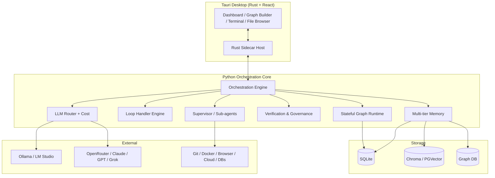

# MaestroAgent

**The ultimate conductor for AI agents — a local-first, model-agnostic desktop "Agent OS" for orchestrating fleets of autonomous agents with advanced looping, dynamic hierarchical sub-agents, persistent memory, and verifiable autonomy.**

[](LICENSE)
[](https://www.python.org/downloads/)
[](https://tauri.app)
[](#roadmap)

---

## Why MaestroAgent?

Existing orchestrators force a trade-off: **CrewAI** is fast to prototype but brittle in production; **LangGraph** is robust but verbose; **Bridgemind / RunMaestro** are closed or limited. MaestroAgent is the **first open, hybrid orchestrator** that combines the ergonomic "crew" abstraction with industrial-grade stateful graphs, native advanced loops, dynamic hierarchical sub-agents, and full observability — all in a local-first desktop app with seamless cloud burst.

### Headline differentiators

| Dimension | MaestroAgent | CrewAI | LangGraph | Bridgemind / RunMaestro |
|---|---|---|---|---|
| Local-first desktop app | ✅ Tauri + Rust | ❌ Lib only | ❌ Lib only | ⚠️ Partial |
| Hybrid graphs + crews | ✅ Crews inside graphs | ❌ Crews only | ❌ Graphs only | ⚠️ |
| Advanced loops (until-verifiable, cron, webhook, file, nested/parallel/meta) | ✅ Native | ❌ Manual | ⚠️ Basic | ⚠️ |
| Dynamic hierarchical sub-agents | ✅ Supervisor + debate/vote/critic | ⚠️ Static | ⚠️ Manual | ⚠️ |
| Model-agnostic routing + cost optimization | ✅ First-class | ⚠️ | ⚠️ | ❌ |
| Multi-tier memory (short/semantic/graph/long-term) | ✅ | ⚠️ | ⚠️ | ⚠️ |
| Verification (critic, evaluator-optimizer, sandbox) | ✅ | ❌ | ⚠️ | ⚠️ |
| Visual graph builder + code view + terminal | ✅ | ❌ | ❌ | ⚠️ |
| Open source (MIT) | ✅ | ✅ | ✅ (MIT) | ❌ |

See [`docs/DIFFERENTIATION.md`](docs/DIFFERENTIATION.md) for the full breakdown.

---

## Architecture at a glance



Full diagram: [`docs/ARCHITECTURE.md`](docs/ARCHITECTURE.md).

---

## Quick start

### Prerequisites

- **Python 3.11+**
- **Node.js 20+** and **pnpm** (or npm)
- **Rust** (stable, via `rustup`)
- **Tauri 2 prerequisites** — see [Tauri setup guide](https://v2.tauri.app/start/prerequisites/)
- *(optional)* **Ollama** or **LM Studio** for local models
- *(optional)* **Docker** for sandboxed tools

### 1. Backend (Python core)

```bash
cd backend
python -m venv .venv && source .venv/bin/activate    # Windows: .venv\Scripts\activate
pip install -e ".[dev]"
maestro --version
```

Run the API server standalone:

```bash
maestro serve --host 0.0.0.0 --port 8765
```

### 2. Desktop app

```bash
cd desktop
pnpm install
pnpm tauri dev
```

The Tauri app launches the Python backend as a managed sidecar on first run.

### 3. Run an example workflow

```bash
maestro run examples/build_saas_mvp.py --goal "Build a notes SaaS with auth + Stripe"
```

Or open the desktop app → **Templates** → **Build SaaS MVP** → Run.

---

## Project layout

```
MaestroAgent/
├── backend/
│   ├── maestro_core/        # Stateful graph engine, checkpoints, streaming
│   ├── maestro_agents/      # Base agent, supervisor, sub-agents, crews, debate
│   ├── maestro_loops/       # Native loops: recursive, cron, webhook, file, nested
│   ├── maestro_memory/      # Multi-tier memory (short / vector / graph / long-term)
│   ├── maestro_verify/      # Critic, evaluator-optimizer, sandbox, recovery
│   ├── maestro_llm/         # Model-agnostic router, providers, cost tracking
│   ├── maestro_api/         # FastAPI server + WebSocket streaming
│   ├── maestro_plugins/     # Plugin loader & registry
│   ├── maestro_cli/         # `maestro` CLI
│   ├── examples/            # Example workflows (SaaS MVP, research crew, ops)
│   └── tests/
├── desktop/
│   ├── src-tauri/           # Rust Tauri shell + Python sidecar host
│   └── src/                 # React UI (dashboard, graph builder, terminal, etc.)
└── docs/
    ├── ARCHITECTURE.md
    ├── SETUP.md
    ├── ROADMAP.md
    ├── DIFFERENTIATION.md
    └── CHALLENGES.md
```

---

## What makes it production-ready

- **Persistent checkpoints** — every graph step is persisted; resume after crash or reboot.
- **Model fallback** — if a provider fails, automatically degrade to a configured backup.
- **Cost guardrails** — per-run budget caps, real-time spend tracking, provider-aware routing.
- **Audit logs** — every agent decision, tool call, and state transition is recorded.
- **Sandboxed tools** — Git/Docker/browser/cloud actions run inside containers by default.
- **Human-in-the-loop** — pause any loop, request approval, inject corrections.
- **Streaming everything** — events flow over WebSocket for live UIs and external hooks.

---

## Roadmap (condensed)

- **v0.1 (alpha)** — core graph engine, sub-agents, native loops, basic UI, SQLite + Chroma memory. ✅ (this release)
- **v0.2** — visual graph builder, evaluator-optimizer loops, plugin marketplace scaffolding.
- **v0.3** — multi-user collaboration, Git-like workflow versioning, voice/multimodal input.
- **v1.0** — cloud burst, self-improving meta-agent, full marketplace, one-click deploy. See [`docs/ROADMAP.md`](docs/ROADMAP.md).

---

## License

MIT © MaestroAgent contributors. See [LICENSE](LICENSE).

## Contributing

PRs welcome. Please read [`docs/ARCHITECTURE.md`](docs/ARCHITECTURE.md) first to understand the layering. The project follows a strict "core is pure Python, no UI deps" rule — see [`docs/SETUP.md`](docs/SETUP.md) for the dev workflow.
