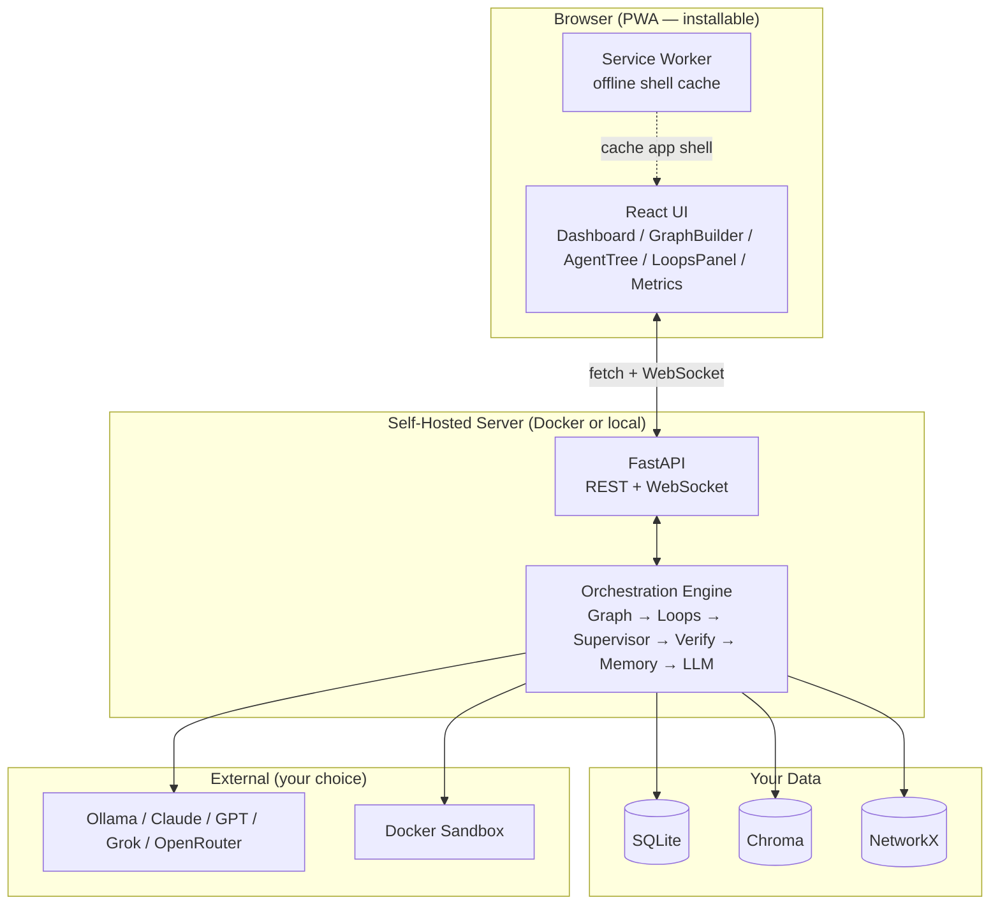

# MaestroAgent

**The open-source, browser-first conductor for AI agents — orchestrate fleets of autonomous agents with advanced looping, dynamic hierarchical sub-agents, persistent memory, and verifiable autonomy. A massive, accessible improvement over Bridgemind.**

[](LICENSE)
[](https://www.python.org/downloads/)
[](https://web.dev/progressive-web-apps/)
[](docker-compose.yml)
[](#roadmap)

---

## Why MaestroAgent?

Bridgemind is a polished **desktop-only, credit-based** vibe-coding platform. MaestroAgent is the opposite bet: **open-source, browser-first, self-hostable, with superior looping and sub-agent primitives**.

- 🌐 **Browser-first PWA** — installable in Chrome/Firefox/Brave/Edge. Runs on desktop, mobile, tablet.
- 🏠 **Self-host with one command** — `./install.sh` or `docker compose up -d`. Your data stays yours.
- 🔓 **MIT licensed** — no vendor lock-in, no credit caps, no cloud dependency.
- 🔁 **Advanced loops** — verifiable exit conditions, nested/parallel/meta, cron/webhook/file-event triggers.
- 🌳 **Dynamic hierarchical sub-agents** — supervisors spawn, delegate, debate, and auto-merge.
- 💾 **Multi-tier memory** — short-term, semantic (Chroma), graph (NetworkX), long-term (SQLite).
- ✅ **Verifiable autonomy** — critic agents, evaluator-optimizer, Docker sandbox, checkpoint resume.
- 💰 **Model-agnostic routing** — per-call cost optimization across Ollama, OpenAI, Anthropic, OpenRouter, Grok, LM Studio.
- 🎤 **Voice input** — Web Speech API for speech-to-agent goal entry.

See [`docs/VS_BRIDGEMIND.md`](docs/VS_BRIDGEMIND.md) for the full feature-by-feature comparison.

---

## Architecture at a glance



---

## Quick start

### Option A — Docker (recommended, 2 minutes)

```bash
git clone https://github.com/your-org/maestroagent.git
cd maestroagent
cp .env.example .env       # add API keys if you have them
./install.sh               # builds + starts the stack
```

Open **http://localhost:8765** → click **Install** in your browser's address bar.

### Option B — Dev mode (no Docker)

```bash
# Terminal 1: backend
cd backend
python -m venv .venv && source .venv/bin/activate
pip install -e ".[dev]"
maestro serve

# Terminal 2: frontend
cd frontend
pnpm install
pnpm dev
```

Open **http://localhost:1420**.

### Option C — Use the hosted demo

*(Coming soon — a public demo instance for trying MaestroAgent without install.)*

Full setup instructions: [`docs/BROWSER_SETUP.md`](docs/BROWSER_SETUP.md).

---

## Project layout

```
MaestroAgent/
├── frontend/              # React 18 + TypeScript PWA (Vite + vite-plugin-pwa)
│   ├── src/
│   │   ├── components/    # 17 components (Dashboard, GraphBuilder, AgentTree, ...)
│   │   ├── store/         # Zustand store
│   │   ├── hooks/         # useVoiceInput, useInterval, useLocalStorage, ...
│   │   ├── lib/           # api.ts (fetch + WS client), utils.ts
│   │   └── styles/        # Tailwind + globals
│   ├── public/            # icon.svg, icons/, manifest
│   ├── scripts/           # gen-icons.py
│   ├── vite.config.ts     # PWA config (manifest + service worker)
│   └── package.json
├── backend/               # Python core (FastAPI sidecar)
│   ├── maestro_core/      # Stateful graph engine, checkpoints, streaming
│   ├── maestro_agents/    # Agent, Supervisor, SubAgent, CrewAdapter, Debate
│   ├── maestro_loops/     # Native loops: recursive, cron, webhook, nested, parallel, meta
│   ├── maestro_memory/    # Short-term, vector, graph, long-term + manager
│   ├── maestro_verify/    # Critic, evaluator-optimizer, sandbox, recovery
│   ├── maestro_llm/       # Router + 6 providers + cost ledger
│   ├── maestro_api/       # FastAPI + WebSocket + serves PWA bundle in self-host
│   ├── maestro_plugins/   # Discovery + builtin tools
│   ├── maestro_cli/       # `maestro` command
│   ├── examples/templates/# build_saas_mvp, research_crew, ops_autopilot
│   ├── sandbox/           # Docker sandbox Dockerfile
│   └── tests/             # pytest suite
├── Dockerfile             # Multi-stage: build frontend + backend → single image
├── docker-compose.yml     # Self-host: maestro + sandbox services
├── install.sh             # One-click install script
├── .env.example           # Environment variable template
└── docs/                  # 8 docs (see below)
```

---

## What you can do in the browser

| Panel | What it does |
|---|---|
| **Dashboard** | Live run summary + event stream + quick stats |
| **Graph Builder** | Drag-and-drop workflow editor (ReactFlow) with custom nodes for agents, supervisors, loops, gates, HITL. Export/import JSON. |
| **Agents** | Live hierarchy tree. Click **+** on a supervisor to spawn a sub-agent. Select 2+ agents to trigger a debate. |
| **Loops** | Monitor active loops with progress bars, scores, and outcomes. Click **New Loop** to attach a verifiable loop mid-run. |
| **Terminal** | Console-style live event log |
| **Files** | Browse the workspace produced by the run |
| **Metrics** | Cost breakdown by provider, token usage, loop iteration histograms |
| **Templates** | One-click workflows + marketplace stub |

**Modals:** Start Run (with 🎤 voice input), Spawn Sub-agent, Trigger Debate, Create Loop.

---

## Documentation

| Doc | What's inside |
|---|---|
| [README.md](README.md) | This file |
| [docs/BROWSER_SETUP.md](docs/BROWSER_SETUP.md) | Browser install + self-host (Docker + dev mode) |
| [docs/VS_BRIDGEMIND.md](docs/VS_BRIDGEMIND.md) | Feature-by-feature comparison vs Bridgemind |
| [docs/ARCHITECTURE.md](docs/ARCHITECTURE.md) | Layered architecture, design principles |
| [docs/ARCHITECTURE_FULLSTACK.md](docs/ARCHITECTURE_FULLSTACK.md) | Full-stack Mermaid diagrams |
| [docs/PROJECT_STRUCTURE.md](docs/PROJECT_STRUCTURE.md) | Complete file tree |
| [docs/ROADMAP.md](docs/ROADMAP.md) | v0.1 → v1.0+ milestones |
| [docs/DIFFERENTIATION.md](docs/DIFFERENTIATION.md) | vs CrewAI / LangGraph |
| [docs/CHALLENGES.md](docs/CHALLENGES.md) | Hard problems + solutions |

---

## Roadmap (condensed)

- **v0.1 (alpha)** — browser PWA, core engine, sub-agents, native loops, self-host Docker. ✅ (this release)
- **v0.2** — push notifications, background sync, evaluator-optimizer UI, plugin marketplace scaffolding.
- **v0.3** — multi-user collaboration, Git-like workflow versioning, cloud burst, Tauri wrapper, editor integration.
- **v1.0** — self-improving meta-agent, full marketplace, one-click deploy, analytics dashboard. See [`docs/ROADMAP.md`](docs/ROADMAP.md).

---

## License

MIT © MaestroAgent contributors. See [LICENSE](LICENSE).

## Contributing

PRs welcome. MaestroAgent is browser-first: the frontend is a standard Vite + React app, the backend is pure Python. Read [`docs/BROWSER_SETUP.md`](docs/BROWSER_SETUP.md) for the dev workflow.
