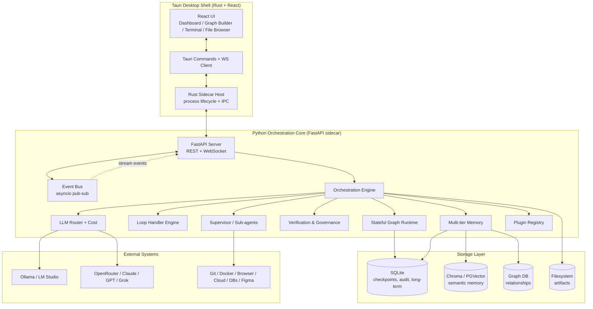
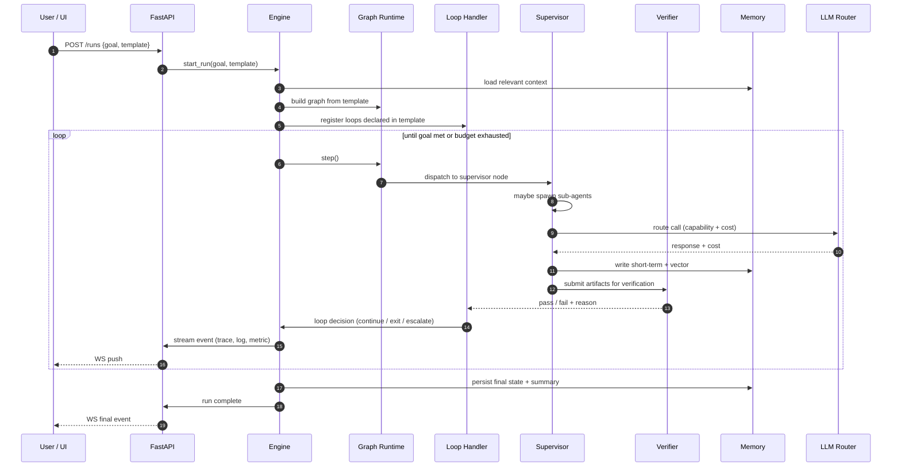
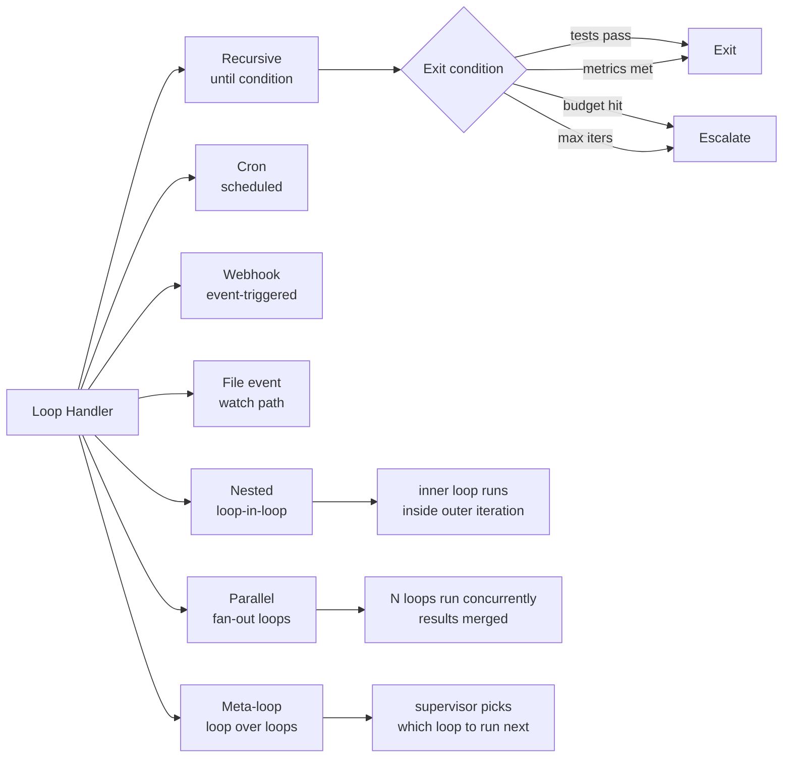
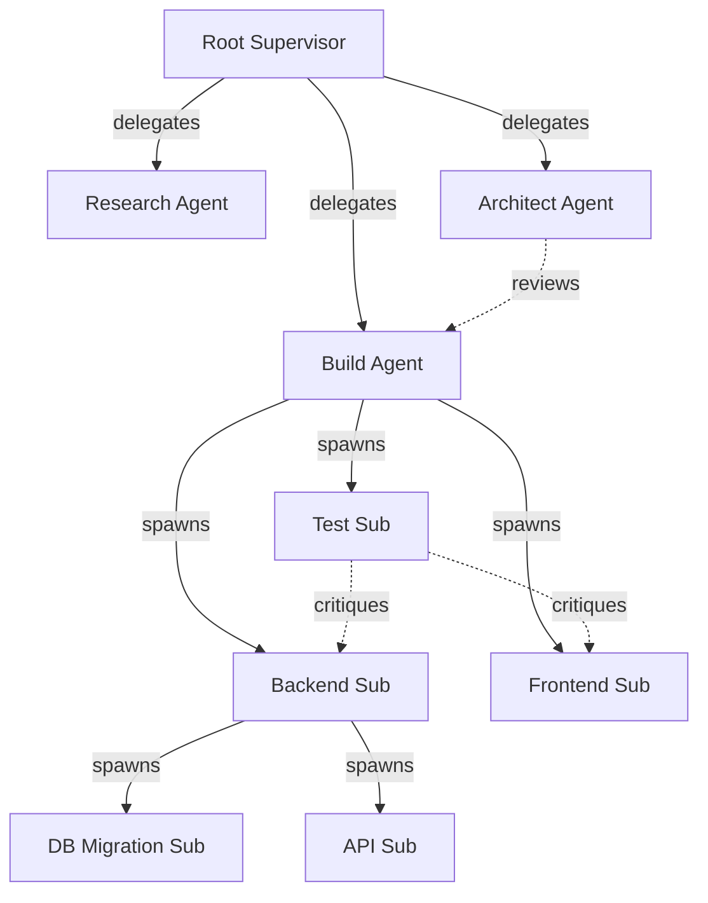
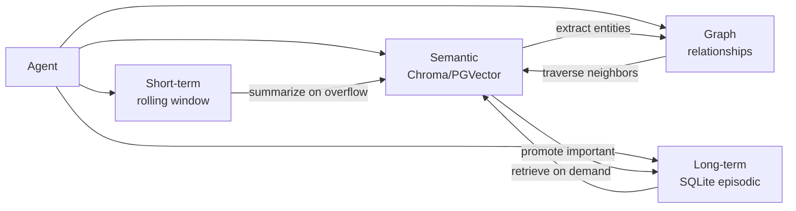
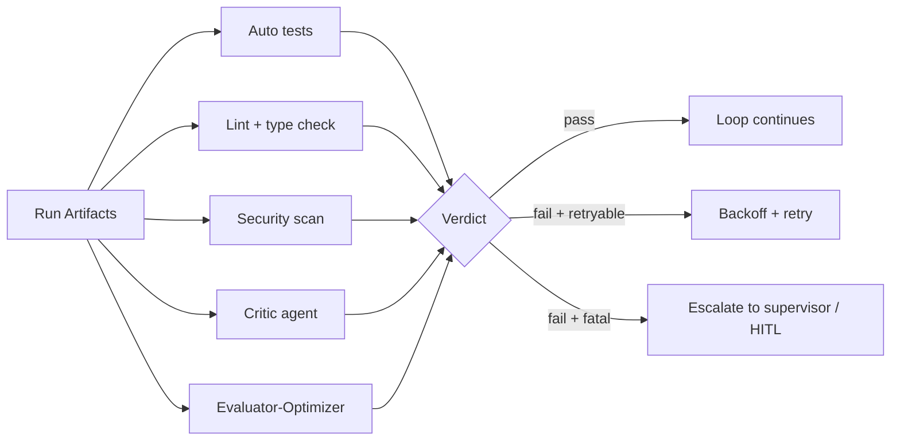
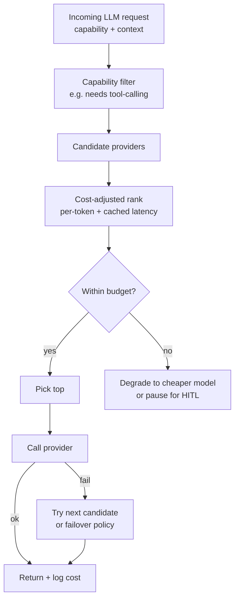
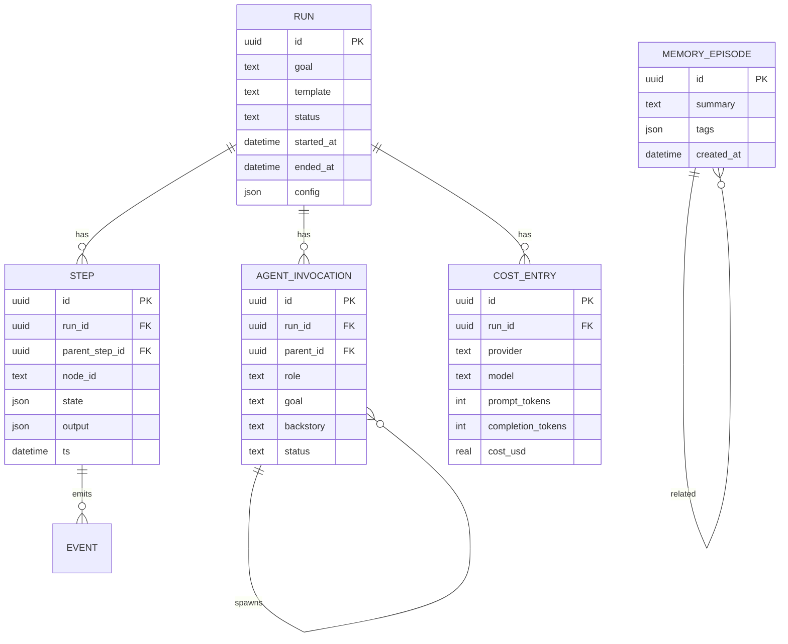

# MaestroAgent — Architecture

This document describes the layered architecture of MaestroAgent, the responsibilities of each module, the data flows between them, and the design decisions that differentiate MaestroAgent from CrewAI, LangGraph, Bridgemind, and other orchestrators.

## 1. Design principles

1. **Local-first, cloud-optional.** The default deployment is a single machine running Tauri + a Python sidecar. Cloud burst is an opt-in scaling mode, never a hard requirement. All persistent state lives on local disk (SQLite + Chroma + a graph DB file) so users own their data.
2. **Hybrid by construction.** We do not force users to choose between CrewAI's "crew" abstraction and LangGraph's stateful graphs. Crews are first-class sub-graphs that can be embedded inside larger graphs. This gives the ergonomics of CrewAI for prototyping and the rigor of LangGraph for production.
3. **Loops are first-class.** Most orchestrators treat iteration as a `while` block hidden inside a node. MaestroAgent exposes loops as a top-level primitive with verifiable exit conditions, retries, backoff, cron, webhooks, file events, and nesting. This is the single biggest reliability win over baselines.
4. **Dynamic hierarchy.** Supervisors can spawn sub-agents at runtime, delegate sub-goals, and merge results. Sub-agents have isolated contexts and tool sets. This is required for open-ended goals (e.g. "build a SaaS MVP") that cannot be planned in full up front.
5. **Verifiable autonomy.** Every loop's exit condition is checked by an independent verifier (test runner, linter, critic agent, evaluator-optimizer). "Until done" is never trusted to the executor's own self-report.
6. **Observability is the product.** Real-time traces, logs, metrics, and audit trails are emitted from every layer over a unified event bus. The UI is a consumer of this bus, not a special case.
7. **Model-agnostic with cost awareness.** The LLM layer is a router that picks providers per-call based on capability, latency, and cost. Budgets are enforced at the router, not the agent.
8. **No UI in core.** `maestro_core` and friends have zero dependencies on any UI framework. The FastAPI server is the only boundary; everything inside it is pure Python and testable headlessly.

## 2. High-level architecture

## 3. Layer responsibilities

### 3.1 Desktop shell (Tauri)

- **Rust sidecar host** (`src-tauri/src/sidecar.rs`) spawns and supervises the Python `maestro serve` process, pipes its stdout/stderr into the UI, and restarts it on crash.
- **Tauri commands** expose a typed IPC surface to React (start run, pause loop, inject HITL, etc.).
- **WebSocket client** in the frontend subscribes to the event bus for streaming traces, logs, metrics.
- **React UI** renders the dashboard, graph builder, agent tree, loop progress, terminal, file browser, and metrics panels. See `desktop/src/components/`.

### 3.2 Python core

| Module | Responsibility |
|---|---|
| `maestro_core` | Stateful graph runtime, checkpoint store, streaming event bus, the orchestration engine that drives a run. |
| `maestro_agents` | Base `Agent` (role/goal/backstory), `Supervisor`, dynamic `SubAgent` spawning, `Crew` adapter, debate/vote/critic primitives. |
| `maestro_loops` | `LoopHandler` with verifiable exit conditions; supports recursive, cron, webhook, file-event, nested/parallel/meta loops. |
| `maestro_memory` | Multi-tier memory: short-term context window, semantic vector store (Chroma/PGVector), graph DB for relationships, long-term SQLite. Auto-summarization, compaction, versioning. |
| `maestro_verify` | Critic agents, evaluator-optimizer loops, Docker sandbox runner, failure recovery + model fallback. |
| `maestro_llm` | Provider-agnostic router, provider adapters (Ollama, OpenAI, Anthropic, OpenRouter, Grok, LM Studio), cost tracking, budget enforcement. |
| `maestro_api` | FastAPI server with REST routes for runs/agents/loops/memory, WebSocket for streaming, HITL endpoints. |
| `maestro_plugins` | Plugin discovery, loading, capability advertisement, sandboxed execution. |
| `maestro_cli` | `maestro` command: `serve`, `run`, `list`, `resume`, `template`, `cost`. |

### 3.3 Storage layer

- **SQLite** stores: checkpoints (one row per graph step), audit log, long-term episodic memory, agent registry, run metadata, cost ledger.
- **Chroma** (or PGVector when running on Postgres) stores: semantic embeddings of agent outputs, tool call results, retrieved context. Used by `maestro_memory.vector`.
- **Graph DB** (a small embedded store — NetworkX-backed in v0.1, optional Neo4j in v0.2) stores: entity relationships, agent hierarchy, tool/asset provenance.
- **Filesystem** stores: run artifacts (generated code, screenshots, downloads), log files, plugin assets.

## 4. Orchestration engine — internal flow

## 5. Advanced loops — taxonomy

Every loop carries: an **exit condition** (a `Condition` object — test runner, metric threshold, critic verdict, or custom callable), a **budget** (max iters, max tokens, max wall-clock), a **backoff policy**, and an **on-exceed** action (escalate to supervisor, fail, or pause for HITL).

## 6. Dynamic sub-agent hierarchy

Key properties:

- **Isolated context.** Each sub-agent has its own short-term memory and tool allowlist. Parents see children's *summaries*, not their full transcripts (token-efficient).
- **Auto-merge.** When a sub-agent finishes, its output is summarized and merged into the parent's context. Conflicts trigger a debate.
- **Debate / vote / critic.** Any agent can request a debate round; a critic agent evaluates proposals; voting uses configurable quorum.
- **Lifecycle.** Sub-agents are garbage-collected when their parent finishes or when they idle past a TTL. Long-lived sub-agents can be "promoted" to top-level for reuse.

## 7. Memory tiers

- **Short-term** is a bounded rolling window with automatic summarization on overflow.
- **Semantic** is the recall layer: embed every output, retrieve top-k by query.
- **Graph** captures entity and agent relationships — "agent X produced file Y which agent Z consumed".
- **Long-term** stores promoted episodes with timestamps, tags, and provenance.

## 8. Verification & governance

- **Critic agent** is an LLM-as-judge that scores outputs against the goal rubric.
- **Evaluator-optimizer** is a LangGraph-style loop: generate → evaluate → optimize → regenerate, with a max iteration budget.
- **Sandbox** runs tests/lint/security inside a Docker container with resource limits and network egress controls.
- **Recovery** handles: model failures (fallback provider), tool failures (retry + report), graph panics (reload from last checkpoint).

## 9. LLM router — decision flow

## 10. Data model (SQLite — core tables)

## 11. Security model

- **Sandboxing.** All tool execution (Git, Docker, browser, shell) happens inside a Docker container with a read-only root filesystem and an allowlist of egress domains. The Python core runs *outside* the sandbox; tools run *inside*.
- **RBAC.** Agents are tagged with a role; tools declare required roles; the engine refuses to dispatch a tool call if the agent's role is not permitted. Memory segments carry the same tags.
- **Audit log.** Every state transition, tool call, LLM call, and human action is written to an append-only audit table. The log is tamper-evident (chained hashes).
- **Secrets.** API keys live in the OS keychain (via `keyring`), never in plaintext config. The Rust shell injects them as env vars into the sidecar at startup.

## 12. Plugin model

- Plugins are Python packages declaring an entry point group `maestro.plugins` with one of: `agent`, `tool`, `loop`, `verifier`, `memory_backend`.
- The plugin registry discovers plugins at startup, validates their manifest, and registers them with the engine.
- Plugins run in the same process as the core (v0.1) for performance; v0.2 will offer a sandboxed out-of-process mode for untrusted plugins.

## 13. What is explicitly NOT in scope (v0.1)

- Cloud burst autoscaling (v0.3).
- Multi-user real-time collaboration (v0.3).
- Marketplace hosting (v1.0).
- Self-improving meta-agent that rewrites core code (v1.0, behind a flag).
- Mobile app (out of scope; mobile is a deploy target, not a control surface).

These boundaries keep v0.1 focused on the reliability and looping story, which is where MaestroAgent most clearly beats the baselines.
