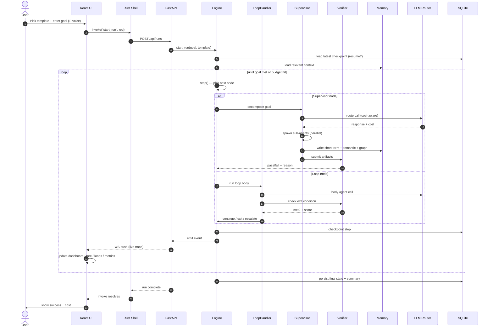
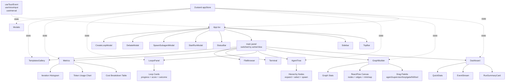
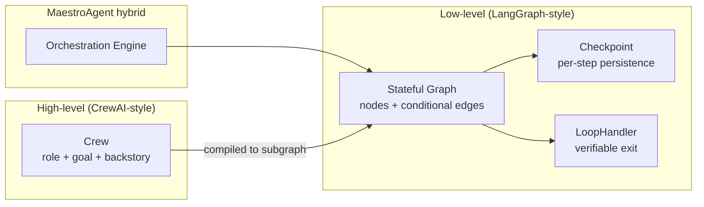
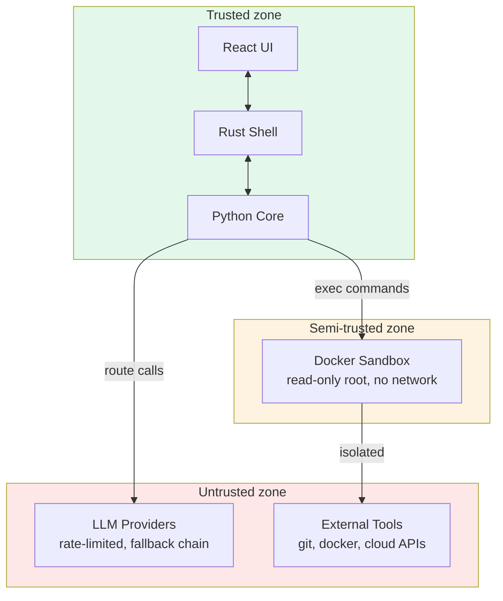

# MaestroAgent — Full-Stack Architecture (Refreshed)

This document is the **refreshed** architecture view showing the complete stack: Python backend, Tauri Rust shell, and React frontend components — and how they communicate.

For the layer-by-layer design rationale, see [`ARCHITECTURE.md`](ARCHITECTURE.md). This doc focuses on the integrated view.

## Full-stack component diagram

```mermaid
flowchart TB
    subgraph Desktop["Desktop App (Tauri 2)"]
        direction TB

        subgraph React["React 18 + TypeScript"]
            Sidebar[Sidebar<br/>8 nav views]
            TopBar[TopBar<br/>status + cancel + new run]
            Dashboard[Dashboard<br/>summary + event stream]
            GraphBuilder[GraphBuilder<br/>ReactFlow drag-drop editor]
            AgentTree[AgentTree<br/>hierarchy + spawn + debate]
            LoopsPanel[LoopsPanel<br/>monitor + create loop]
            Terminal[Terminal<br/>console log]
            FileBrowser[FileBrowser<br/>workspace tree]
            Metrics[Metrics<br/>cost + tokens + charts]
            Templates[TemplatesGallery<br/>one-click + marketplace]
            Modals[Modals<br/>StartRun + Spawn + Debate + CreateLoop]
            Store[Zustand Store<br/>appStore.ts]
            Hooks[Hooks<br/>useTauriEvent + useVoiceInput]
        end

        subgraph Rust["Rust Shell (src-tauri)"]
            Sidecar[Sidecar Host<br/>spawn + supervise Python]
            Commands[Tauri Commands<br/>17 invoke handlers]
            HealthCheck[Health Check<br/>polls /api/health]
        end
    end

    subgraph Python["Python Core (FastAPI sidecar)"]
        direction TB
        API[FastAPI Server<br/>REST + WebSocket]
        Bus[Event Bus<br/>asyncio pub-sub]
        Engine[Orchestration Engine]
        Graph[Stateful Graph Runtime]
        Loops[Loop Handler Engine]
        Agents[Agents + Supervisor + Sub-agents]
        Verify[Verification + Sandbox]
        Memory[Multi-tier Memory]
        LLM[LLM Router + Cost]
        Plugins[Plugin Registry]
    end

    subgraph Storage["Storage"]
        SQLite[(SQLite<br/>checkpoints + audit + costs + episodes)]
        Chroma[(Chroma<br/>semantic vector)]
        GraphDB[(NetworkX<br/>entity graph)]
        FS[(Filesystem<br/>artifacts + workspace)]
    end

    subgraph External["External"]
        Ollama[Ollama / LM Studio]
        Cloud[OpenRouter / Claude / GPT / Grok]
        Docker[Docker Sandbox<br/>git, shell, tests]
    end

    %% React ↔ Rust (Tauri invoke)
    Store <-->|invoke| Commands
    Hooks <-->|listen events| Sidecar

    %% Rust ↔ Python (HTTP)
    Commands <-->|HTTP/JSON| API
    Sidecar <-->|spawn + supervise| API
    HealthCheck -->|GET /api/health| API

    %% Python internal
    API <--> Bus
    API --> Engine
    Engine --> Graph
    Engine --> Loops
    Engine --> Agents
    Engine --> Verify
    Engine --> Memory
    Engine --> LLM
    Engine --> Plugins
    Bus -.->|stream events| API

    %% Storage
    Graph --> SQLite
    Memory --> SQLite
    Memory --> Chroma
    Memory --> GraphDB
    Engine --> FS

    %% External
    LLM --> Ollama
    LLM --> Cloud
    Agents --> Docker

    %% React ↔ Python (WebSocket, direct from browser)
    Store <-.->|WebSocket /ws/{run_id}| API
```

## Data flow: a single run, end to end



## React component tree



## Tauri command surface (Rust → Python)

Every Tauri command is a thin HTTP proxy to the Python sidecar. The Rust shell does not interpret run state.

| Tauri command | HTTP | Purpose |
|---|---|---|
| `start_run` | `POST /api/runs` | Launch a new run |
| `resume_run` | `POST /api/runs/{id}/resume` | Resume a paused run |
| `cancel_run` | `POST /api/runs/{id}/cancel` | Cancel a running task |
| `get_run` | `GET /api/runs/{id}` | Get run summary |
| `get_live_state` | `GET /api/runs/{id}/live` | Snapshot of agents + loops + cost |
| `list_templates` | `GET /api/templates` | List available templates |
| `sidecar_health` | `GET /api/health` | Health check |
| `spawn_subagent` | `POST /api/runs/{id}/spawn` | Spawn sub-agent under supervisor |
| `trigger_debate` | `POST /api/runs/{id}/debate` | Trigger debate between agents |
| `create_loop` | `POST /api/runs/{id}/loops` | Attach a new loop to a run |
| `get_cost_breakdown` | `GET /api/costs/{id}` | Per-run cost by provider |
| `get_audit_log` | `GET /api/runs/{id}/audit` | Tamper-evident audit log |
| `recall_memory` | `POST /api/memory/recall` | Multi-tier memory recall |
| `promote_memory` | `POST /api/memory/promote` | Promote entry to long-term |
| `list_plugins` | `GET /api/health` (plugins field) | List installed plugins |
| `list_providers` | `GET /api/health` (providers field) | List available LLM providers |
| `open_external` | (local) | Open URL in default browser |

## WebSocket event protocol

The UI subscribes to `/ws/{run_id}` and receives a stream of typed events:

```json
{
  "type": "loop.iteration",
  "run_id": "abc-123",
  "ts": "2026-06-23T10:15:30.123Z",
  "event_id": "evt-456",
  "payload": {
    "loop_id": "fix_until_tests_pass",
    "iteration": 3,
    "condition_met": false,
    "condition_reason": "tests failed (exit 1): 2 errors",
    "score": 0.4
  }
}
```

Event types the UI handles:
- `run.started` / `run.completed` / `run.failed`
- `step.started` / `step.completed` / `step.failed`
- `loop.iteration` / `loop.exit`
- `agent.spawned` / `agent.completed` / `agent.debate`
- `llm.call.completed` (for cost tracking)
- `tool.call.completed`
- `memory.write`
- `hitl.requested` / `hitl.resolved`
- `budget.warning`

## The hybrid orchestration model



A `Crew` is wrapped as a single composite node. The graph handles workflow-level concerns (loops, branches, HITL); the crew handles task-level execution. Users graduate from crew-speak to graph-speak as complexity grows — without leaving the same run.

## Security boundaries



- **Trusted:** UI, Rust shell, Python core. These run on the user's machine with full privileges.
- **Semi-trusted:** Docker sandbox. Tool calls execute here with read-only root, no network (by default), and resource limits.
- **Untrusted:** LLM providers and external tools. Rate-limited, failover-chained, and audited.

## What this architecture buys you

1. **Crash recovery.** The Rust shell supervises the Python sidecar. The Python core checkpoints every step. A crash at any layer resumes from the last good state.
2. **Local-first.** Everything runs on the user's machine. The only network calls are to LLM providers (which the user configures) and to external tools (which run in the sandbox).
3. **Observability.** Every transition flows through the event bus → WebSocket → UI. The dashboard is a consumer, not a special case.
4. **Extensibility.** Plugins are discovered from the filesystem. Templates are Python files. Tools are callables. No build step needed to add any of them.
5. **Model-agnostic.** The router picks the best provider per call. Swap providers without touching agent code.
